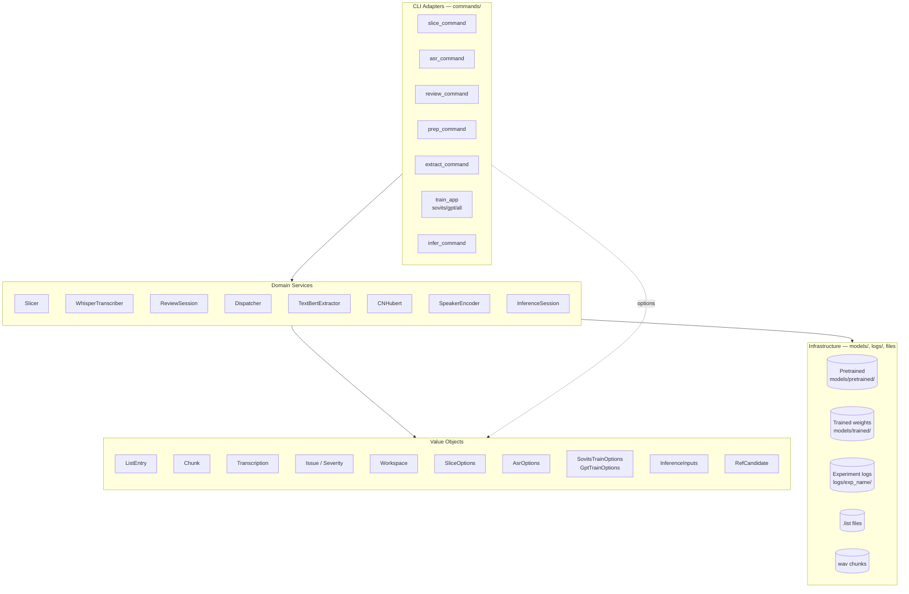
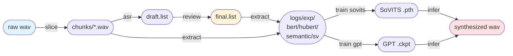
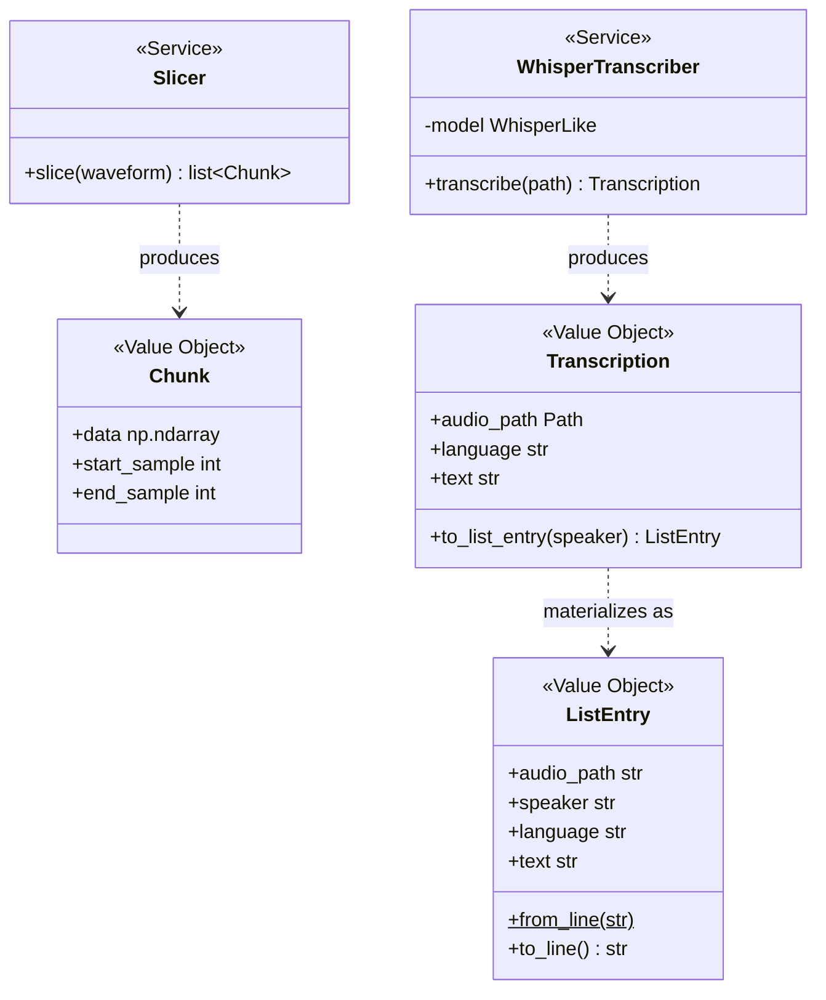
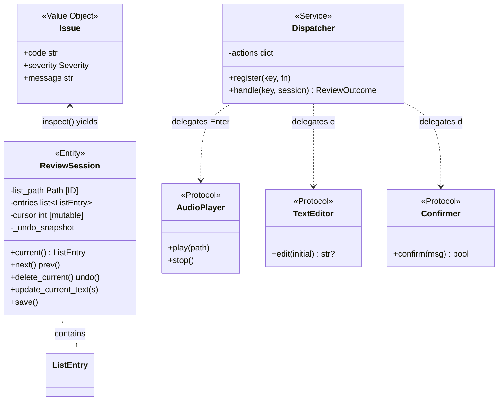
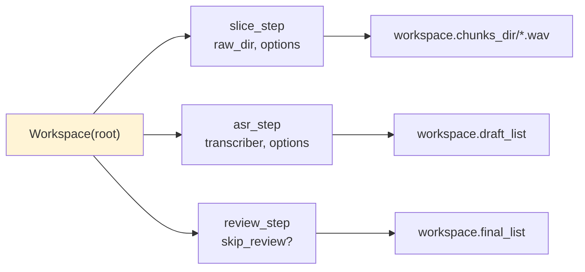
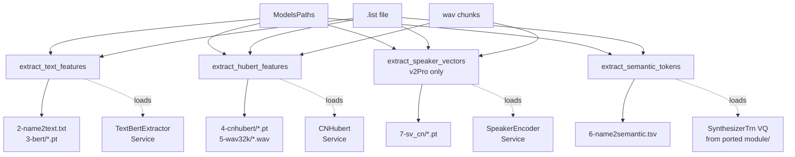
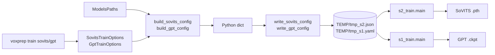
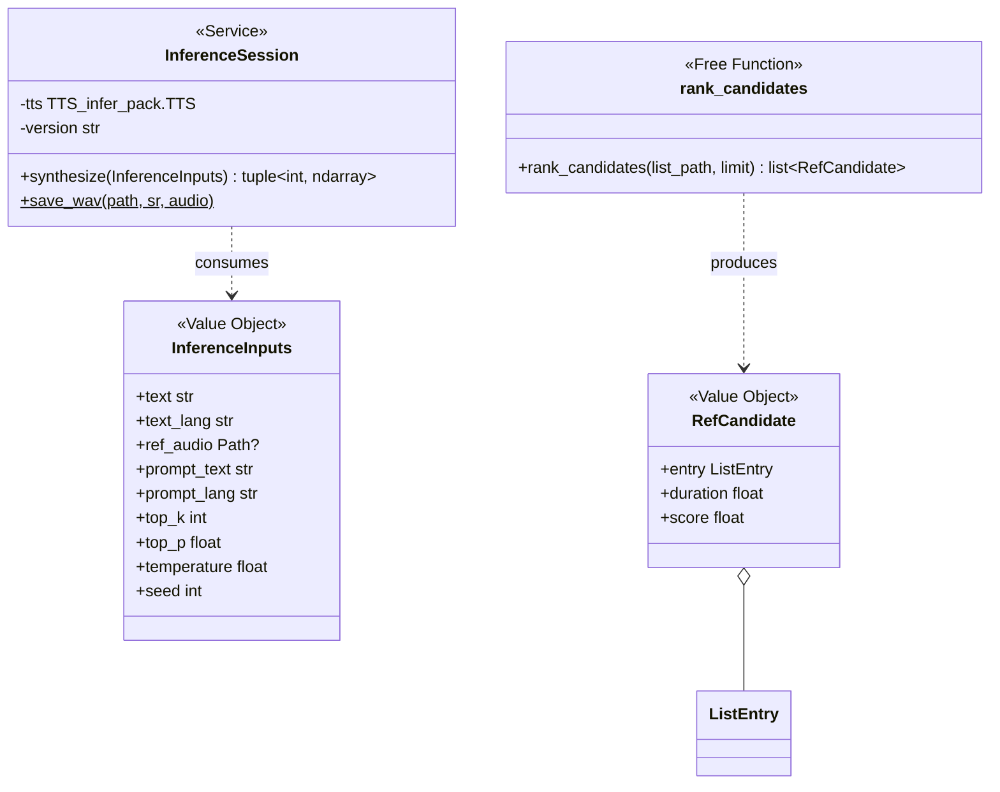
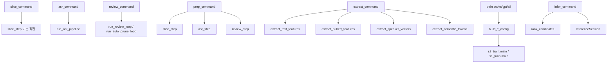

# voxprep 아키텍처 — ODP 관점 전체 구성도

voxprep은 GPT-SoVITS 전처리→학습→추론 파이프라인을 **Object Design Practices(ODP)** 원칙으로 구조화한 CLI입니다. 이 문서는 시스템 전체 구성과 객체 분류(Value Object / Entity / Service / DTO), 그리고 그들이 어떻게 유기적으로 엮이는지를 보여줍니다.

---

## 1. 레이어 구조 (10,000 ft view)



---

## 2. 파이프라인 흐름 (전체 데이터 경로)



각 단계는 **독립 실행 가능**하면서 `prep`(1+2+3), `train all`(5+6) 같은 **조합 어댑터**로도 쓸 수 있습니다.

---

## 3. 객체 분류 — ODP 4분류

### 3-1. Value Objects (값으로 식별, 불변, `@dataclass(frozen=True)`)

| 객체 | 위치 | 필드 | 역할 |
|------|------|------|------|
| `ListEntry` | `parsing/list_file.py` | audio_path, speaker, language, text | `.list` 한 줄 |
| `Chunk` | `slicing/slicer.py` | data(np), start_sample, end_sample | 분할된 오디오 조각 |
| `Transcription` | `transcription/types.py` | audio_path, language, text | ASR 결과 1건 |
| `Issue` | `review/issues.py` | code, severity, message | 자동 플래그 1건 |
| `Severity` | `review/issues.py` | Enum (INFO/WARN/…) | Issue 등급 |
| `Workspace` | `pipeline/workspace.py` | root + 파생 경로들 | prep 산출물 루트 |
| `SliceOptions` | `slicing/options.py` | sample_rate, threshold, min_length, … | slice 설정 묶음 |
| `AsrOptions` | `transcription/options.py` | language, model_size, device, … | asr 설정 묶음 |
| `SovitsTrainOptions` | `training/config_builder.py` | exp_name, epochs, save_every, … | SoVITS 학습 설정 |
| `GptTrainOptions` | `training/config_builder.py` | exp_name, epochs, if_dpo, … | GPT 학습 설정 |
| `InferenceInputs` | `inference/session.py` | text, ref_audio, prompt_text, top_k, … | 추론 1회 입력 |
| `RefCandidate` | `inference/ref_picker.py` | entry, duration, score | 참조 오디오 후보 |
| `ReviewOutcome` | `review/keybindings.py` | Enum (CONTINUE/QUIT) | 키 액션 결과 |
| `GptSovitsPaths` *(extract)* | `extract/models_path.py` | root, version + 파생 경로 | 모델 파일 경로 모음 |

### 3-2. Entity (ID로 식별, 상태 변화)

| 객체 | 위치 | ID | 상태 |
|------|------|----|------|
| **`ReviewSession`** | `review/session.py` | `list_path` (파일 경로) | `cursor`, `entries`, `_undo_snapshot` — n/b/d/e/u 키로 변함 |

voxprep 전체에서 Entity는 **`ReviewSession` 하나**뿐입니다. ODP 원칙상 "의심되면 VO로 시작"해서 실제로 상태 변이가 필요할 때만 Entity로 승격하는 것을 반영한 결과.

### 3-3. Services (상태 없음, DI 가능)

| 서비스 | 위치 | 생성자 의존성 | 메서드 |
|--------|------|---------------|--------|
| `Slicer` | `slicing/slicer.py` | sr, threshold, min_length, … | `slice(waveform)` |
| `WhisperTranscriber` | `transcription/whisper.py` | `WhisperLike` model | `transcribe(path)` |
| `Dispatcher` | `review/keybindings.py` | (빈) | `register(key, action)`, `handle(key, session)` |
| `SubprocessAudioPlayer` | `review/player.py` | (빈) | `play(path)`, `stop()` |
| `PromptToolkitTextEditor` | `review/editor.py` | (빈) | `edit(initial) -> str\|None` |
| `PromptToolkitConfirmer` | `review/confirmer.py` | (빈) | `confirm(message) -> bool` |
| `TextBertExtractor` | `extract/text_features.py` | bert_dir, device, is_half | `bert_feature(text, word2ph)` |
| `CNHubert` | `extract/cnhubert.py` | base_path (HuBERT ckpt dir) | `forward(x)` |
| `SpeakerEncoder` | `extract/speaker_vectors.py` | sv_ckpt, device, is_half | `embed(wav32k)` |
| `InferenceSession` | `inference/session.py` | sovits/gpt weights, version | `synthesize(InferenceInputs)` |
| `ModelsPaths` | `extract/models_path.py` | root(optional) | `bert_dir`, `cnhubert_dir`, `sovits_pretrained(v)` 등 |

Protocol(인터페이스) — `WhisperLike`, `AudioPlayer`, `TextEditor`, `Confirmer` — 는 테스트 더블과 실체를 바꿔 끼우는 seam 역할.

### 3-4. Free functions (순수 함수 또는 Service 성격)

개별 클래스로 묶을 응집도가 없는 작업은 자유 함수로 유지합니다:

- **검사 규칙**: `check_empty_text`, `check_too_short`, `check_interjection_only`, `check_non_korean_noise`, `check_too_long`, `check_punctuation_only`, `inspect` — `review/issues.py`
- **파이프라인 단계**: `slice_step`, `asr_step`, `review_step` — `pipeline/runner.py`
- **특징 추출**: `extract_text_features`, `extract_hubert_features`, `extract_semantic_tokens`, `extract_speaker_vectors`
- **리뷰 루프**: `run_review_loop`, `run_auto_prune_loop`
- **설정 빌더**: `build_sovits_config`, `build_gpt_config`, `write_sovits_config`, `write_gpt_config`
- **후보 랭킹**: `rank_candidates` — `inference/ref_picker.py`
- **경로/버전 해석**: `resolve_root`, `resolve_python`, `validate_version`, `select_device`

---

## 4. 단계별 객체 연결도

### 4-1. Preprocessing (slice → asr → review)



### 4-2. Review (ReviewSession 중심)



**키 처리 흐름** (`run_review_loop`):

```
입력 키 → Dispatcher.handle(key, session)
              │
              ├─ 'n' → session.next()
              ├─ 'b' → session.prev()
              ├─ 'Enter' → player.stop() + player.play(session.current().audio_path)
              ├─ 'e' → editor.edit(...) → session.update_current_text(...) → session.save()
              ├─ 'd' → confirmer.confirm(...) → session.delete_current() → session.save()
              ├─ 'u' → session.undo() → session.save()
              └─ 'q' → return QUIT
```

### 4-3. Prep 파이프라인 (Workspace + Step 함수들)



`Workspace` VO 가 경로 묶음을 캡슐화 → 각 step 은 VO 를 받아 경로 유도:

```
Workspace(root=./datasets/myvoice)
  .chunks_dir   → ./datasets/myvoice/chunks
  .draft_list   → ./datasets/myvoice/draft.list
  .final_list   → ./datasets/myvoice/final.list
```

### 4-4. Extract (특징 추출 4단계)



4단계는 서로 **의존성이 거의 없고** 같은 `ListEntry` 목록을 입력으로 병렬 실행 가능한 구조 (현재는 순차).

### 4-5. Train (config 빌드 + subprocess 실행)



**VO(Options) → dict → 파일 → 학습 스크립트** 순서로 경계를 넘어감. 학습 스크립트 자체는 이식된 GPT-SoVITS 코드라 voxprep 도메인에서는 "외부 도구"처럼 취급.

### 4-6. Infer (InferenceSession + RefCandidate)



`voxprep infer` CLI 어댑터가 `rank_candidates`로 좋은 참조 오디오 자동 선택 → `InferenceInputs` 조립 → `InferenceSession.synthesize` → wav 저장.

---

## 5. CLI 어댑터 — 얇은 층



**원칙**: `commands/*.py` 는 **"Typer 인자 수집 → VO 조립 → Service/free function 호출"** 3줄짜리 어댑터. 비즈니스 로직은 도메인 모듈에.

예시 — `prep_command` 본체 (개념 스케치):
```python
def prep_command(raw_audio, workspace, speaker, sample_rate, ...):
    ws = Workspace(root=workspace); ws.ensure_root()
    slice_opts = SliceOptions(sample_rate=sample_rate, ...)
    asr_opts = AsrOptions(language=language, ...)
    slice_step(ws, raw_audio, options=slice_opts)
    transcriber = _build_transcriber(asr_opts)
    asr_step(ws, transcriber, speaker=speaker, options=asr_opts)
    review_step(ws, skip_review=skip_review)
```

모든 비즈니스 결정(경로/파일명/알고리즘)은 도메인 쪽, CLI는 "사용자 인자 → 도메인 호출" 번역자.

---

## 6. 왜 이렇게 나뉘었나 — 핵심 판단

### 왜 VO가 많고 Entity는 하나뿐인가
- 대부분의 데이터(리스트 엔트리, 청크, 설정)는 **생성 후 바뀌지 않음** → VO
- `ReviewSession` 만 사용자 키 입력에 따라 cursor/entries가 실제로 변함 → Entity
- VO는 frozen dataclass + `__eq__`/`__hash__` 자동 → 테스트 단언이 쉬움

### 왜 Service에 Protocol을 썼나
- 테스트에서 `FakeWhisperModel`, `SpyPlayer`, `FakeEditor` 등으로 교체 가능해야 함
- 실제 구현(`SubprocessAudioPlayer`, `PromptToolkitTextEditor`)은 I/O 포함 → 단위 테스트에서 사용 불가
- Protocol만 있으면 덕 타이핑으로 seam 확보

### 왜 단계별 함수가 클래스가 아닌가
- `slice_step` / `asr_step` / `review_step` 은 **상태 없음**, 입력 → 출력
- 4~6줄짜리 오케스트레이션에 클래스는 과잉
- 필요해지면(예: 진행률 콜백이 복잡해지면) `PipelineRunner` 클래스로 승격 검토

### 왜 Options VO를 따로 뺐나
- Phase 10에서 `prep_command` 인자 16개가 각 step으로 펼쳐서 전달되는 고통이 실제로 왔음
- 그때 `SliceOptions`, `AsrOptions`를 추출 (Tidy First: refactor 별도 커밋)
- 현재 `SovitsTrainOptions` / `GptTrainOptions` / `InferenceInputs` 도 같은 원칙

### 왜 추론을 Entity로 만들지 않았나
- `InferenceSession`은 내부 TTS 인스턴스 + 로드된 가중치가 있어 "상태"처럼 보임
- 하지만 **식별자가 없음** (어떤 세션이냐를 구분할 필요 없음)
- 생성자에 의존성을 받고 `synthesize()` 호출만 함 → Service 기준에 더 맞음
- Phase 16(tkinter GUI)에서 세션 목록이 필요해지면 Entity로 승격 검토

---

## 7. 모듈 지도 (디렉토리별 책임)

```
src/voxprep/
├── cli.py                          # Typer app 루트 — 커맨드 등록만
│
├── commands/                       # CLI 어댑터 (층 1: 얇은 외곽)
│   ├── slice.py, asr.py, review.py
│   ├── prep.py, extract.py, train.py, infer.py
│
├── parsing/                        # 도메인: .list 포맷 (Phase 02)
│   ├── list_file.py                #   ListEntry [VO]
│   └── errors.py                   #   MalformedListLineError
│
├── slicing/                        # 도메인: 오디오 분할 (Phase 03)
│   ├── slicer.py                   #   Slicer [Service] + Chunk [VO]
│   ├── io.py                       #   load_audio / normalize_chunk / save_chunk
│   └── options.py                  #   SliceOptions [VO]
│
├── transcription/                  # 도메인: ASR (Phase 04)
│   ├── whisper.py                  #   WhisperTranscriber [Service] + WhisperLike [Protocol]
│   ├── types.py                    #   Transcription [VO]
│   ├── languages.py                #   validate_language / LANGUAGE_CODES
│   ├── model_factory.py            #   load_whisper
│   └── options.py                  #   AsrOptions [VO]
│
├── review/                         # 도메인: 검수 TUI (Phase 05–09)
│   ├── session.py                  #   ReviewSession [Entity]
│   ├── keybindings.py              #   Dispatcher [Service] + ReviewOutcome [Enum]
│   ├── render.py                   #   render_session (Rich)
│   ├── loop.py                     #   run_review_loop / run_auto_prune_loop
│   ├── player.py                   #   AudioPlayer [Protocol] + Subprocess* [Service]
│   ├── editor.py                   #   TextEditor [Protocol] + PromptToolkit* [Service]
│   ├── confirmer.py                #   Confirmer [Protocol] + PromptToolkit* [Service]
│   └── issues.py                   #   Issue [VO] + Severity [Enum] + 검사 함수들
│
├── pipeline/                       # 도메인: prep 오케스트레이션 (Phase 10)
│   ├── workspace.py                #   Workspace [VO]
│   └── runner.py                   #   slice_step / asr_step / review_step
│
├── extract/                        # 도메인: 특징 추출 (Phase 13, 이식)
│   ├── models_path.py              #   ModelsPaths [Service]
│   ├── text_features.py            #   TextBertExtractor [Service] + extract_text_features
│   ├── hubert_features.py          #   extract_hubert_features
│   ├── speaker_vectors.py          #   SpeakerEncoder [Service] + extract_speaker_vectors
│   ├── semantic_tokens.py          #   extract_semantic_tokens
│   ├── cnhubert.py                 #   CNHubert [Service]
│   ├── audio_utils.py              #   load_audio / clean_path
│   ├── hparams.py                  #   HParams (dict wrapper)
│   ├── text/                       #   (이식) 언어별 음소 변환 28 파일
│   ├── module/                     #   (이식) SoVITS VQ 모델 16 파일
│   ├── eres2net/                   #   (이식) 화자 벡터 모델
│   └── configs/                    #   s1/s2 설정 템플릿
│
├── training/                       # 도메인: 학습 (Phase 14, 이식)
│   ├── s2_train.py                 #   (이식) SoVITS 학습 entry
│   ├── s1_train.py                 #   (이식) GPT 학습 entry
│   ├── process_ckpt.py             #   savee / load_sovits_new (커스텀 포맷)
│   ├── config_builder.py           #   SovitsTrainOptions, GptTrainOptions [VO] + build_*
│   ├── utils.py                    #   HParams / checkpoint 유틸
│   ├── AR/                         #   (이식) GPT 모델 전체
│   └── i18n/                       #   (이식) 다국어 리소스
│
└── inference/                      # 도메인: 추론 (Phase 15, 이식)
    ├── session.py                  #   InferenceSession [Service] + InferenceInputs [VO]
    ├── ref_picker.py               #   RefCandidate [VO] + rank_candidates
    ├── sv.py                       #   SV (얇은 래퍼, SpeakerEncoder와 유사)
    └── tts_pack/                   #   (이식) TTS_infer_pack 3 파일
```

범례:
- `[VO]` — Value Object
- `[Entity]` — Entity
- `[Service]` — Service
- `[Protocol]` — Python Protocol (덕 타입 인터페이스)
- `(이식)` — GPT-SoVITS에서 이식된 코드, voxprep 컨벤션에 맞춰 import만 조정

---

## 8. 테스트 더블 위치

`tests/fixtures/doubles.py` 에 공용 테스트 더블:

```
FakeWhisperModel       — implements WhisperLike
  └─ WhisperTranscriber(model=FakeWhisperModel(...)) 에 주입

SpyPlayer              — implements AudioPlayer
  └─ 재생 호출 기록, 스펙 확인용

FakeEditor             — implements TextEditor
  └─ 미리 정한 return_value 로 edit() 응답

ScriptedConfirmer      — implements Confirmer
  └─ 응답 시퀀스 주입 (y/n)
```

이 더블들 덕에 `ReviewSession` + `Dispatcher` 상호작용을 실제 I/O 없이 단위 테스트 가능. 73개 테스트 중 대부분이 이 Protocol-과-더블 패턴 기반.

---

## 9. 요약

- **1 Entity** (`ReviewSession`) — 상태 변이가 실제 필요한 유일한 객체
- **14개 VO** — 데이터·설정 전달 경계에서 안전성 제공
- **11개 Service** (+ 4 Protocol) — 의존성 주입 + 테스트 가능성
- **CLI 7 커맨드** — 전부 얇은 어댑터, 도메인 직접 호출
- **레이어 경계**: CLI → 도메인 서비스 → VO/Entity → 인프라(파일/모델)

voxprep은 "의심되면 VO, 상태 변이가 실제 나타나면 Entity, 여러 케이스에서 재사용되고 의존성이 주입되면 Service" 라는 ODP 기본 판단을 각 Phase 에서 반복 적용해서 만든 구조입니다.

---

## 참고

- ODP 46 규칙: `~/.claude/skills/object-design-practices/`
- 각 Phase의 ODP 판단 근거: `docs/phases/phaseNN-*.md`
- 엔드-투-엔드 사용법: [`docs/GUIDE.md`](GUIDE.md)
